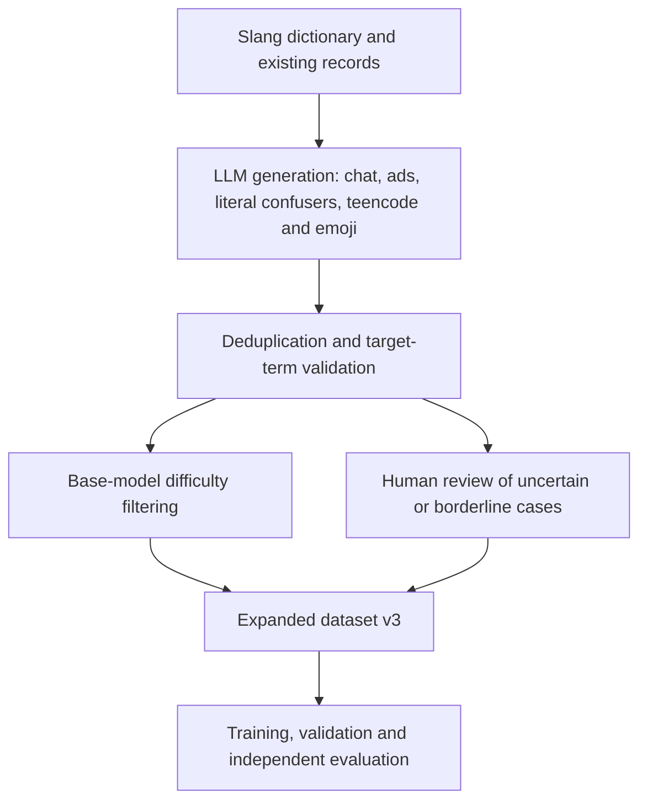
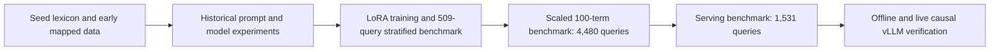
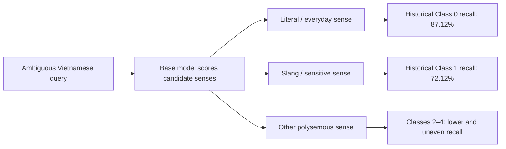
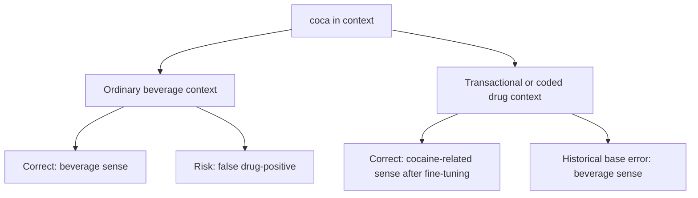
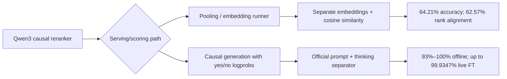
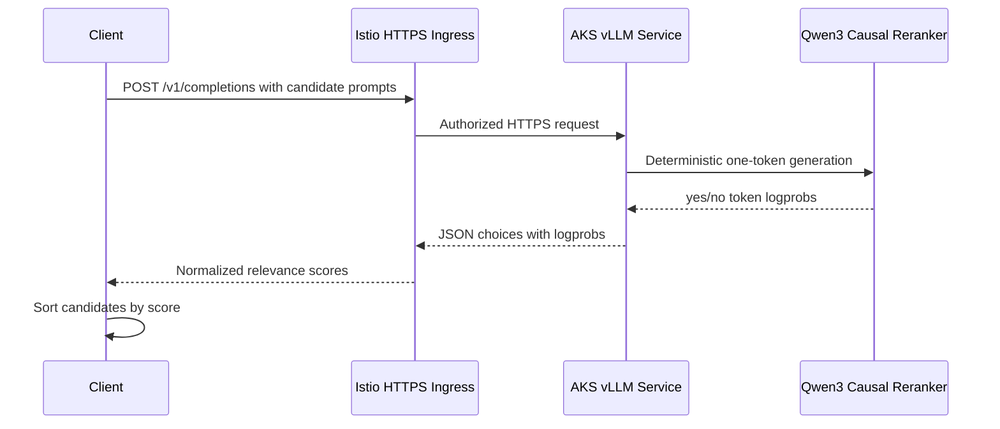

# Fine-Tuning, Serving, and Evaluation of a Vietnamese Slang Qwen Reranker

## Abstract

Vietnamese slang, underground polysemous code words, and emoji-coded terminology are highly context-dependent. The same surface form can refer to an ordinary object, a social expression, or a sensitive criminal-domain concept. Standard rerankers often over-rely on lexical overlap and therefore struggle to distinguish literal contexts from coded drug, prostitution, gambling, theft, smuggling, and weapon-related contexts.

This project develops a domain-adapted Vietnamese Criminal Slang Cross-Encoder Reranker based on `Qwen/Qwen3-Reranker-0.6B`. The development process combines dataset curation, hard-confuser generation, LoRA/PEFT fine-tuning, calibrated binary cross-entropy, ranking-aware validation, Optuna hyperparameter optimization, offline benchmarking, and production serving experiments on Azure Kubernetes Service (AKS).

The current evidence shows a clear progression. An earlier full fine-tuning recipe caused catastrophic forgetting and reduced the 560-sample benchmark accuracy below the base model. A later LoRA-based recipe improved the historical benchmark to approximately 74%, reached **85.85% Top-1 accuracy** on a 509-query stratified benchmark, and reached **97.86%** on a 4,480-query scaled benchmark. The fine-tuned causal model achieved **99.9347% Top-1 accuracy** on the documented 1,531-query live AKS vLLM evaluation, with 1,530 correct predictions and no failed requests.

These results must be interpreted as versioned evidence rather than one single learning curve. The repository contains multiple datasets, checkpoints, prompt formats, endpoints, and evaluation implementations. The final report therefore separates historical snapshots, current benchmark results, production-serving results, projected improvements, and unresolved reproducibility issues.

## Key Conclusions & Validated Hypotheses

- **LoRA fine-tuning improves contextual sense disambiguation.** The 509-query stratified benchmark increases from 60.51% for the base model to 85.85% for the fine-tuned model (+25.34 percentage points). The 4,480-query benchmark increases from 60.74% to 97.86% (+37.12 percentage points).

- **The final fine-tuned causal serving path is highly accurate.** The documented AKS vLLM endpoint achieves 99.9347% Top-1 accuracy (1,530/1,531) on the live production evaluation, with a 0.0% request failure rate.

- **The original full fine-tuning recipe caused base-model collapse.** In the historical 560-sample experiment, the old fine-tuned model scored 48.5%, below the 54.1% base-model score, and its `db_slang` subset score collapsed to 30.4%.

- **LoRA reduces catastrophic forgetting.** The improved recipe freezes approximately 99.5% of base weights and adapts attention and MLP projection modules. The historical improved checkpoint scored 69.6% on `db_slang`, compared with 30.4% for the old fine-tuned checkpoint.

- **Task-aligned ranking evaluation is essential.** The training pipeline uses candidate-group ranking and Top-1 evaluation rather than Pearson correlation. When each query has one positive candidate, `MRR@1` is mathematically identical to Top-1 accuracy, while full MRR/MAP can provide partial credit for lower ranks.

- **Prompt and serving format materially affect performance.** The model is a causal reranker whose relevance signal is expressed through the next-token decision between `yes` and `no` after the expected Qwen instruction and thinking separator. Generic pooling/embedding serving does not reproduce this behavior.

- **Pooling vLLM is unsuitable for this causal reranker.** The documented pooling path reaches 64.21% accuracy and 62.57% full-rank alignment, compared with 93.73% and 100% respectively for the native CrossEncoder evaluation.

- **Data coverage is a major bottleneck.** The data-expansion strategy identifies hard literal/slang confusers, long-tail terms, noisy chat, emojis, and coded advertisements as the main areas for improving generalization.

- **Reported results are not all directly comparable.** The repository contains 560/577-record historical artifacts, a 509-query stratified evaluation, a 1,531-query serving benchmark, and a 4,480-query scaled benchmark. They use different data files and in some cases different model names or serving routes.

## 1. Training Dataset Overview

### 1.1 Dataset sources and accounting

The current dataset analysis uses three primary JSON files. The seed file stores one sentence directly in each JSON object, while the scaled and augmented files store term-level objects containing multiple annotation records.

| Dataset file | JSON objects / records | Unique terms within file | Sentence representation |
|---|---:|---:|---|
| `seed_lexicon_sense_hard_examples.json` | 180 | 151 | One direct `sentence` per object |
| `slang_dataset_scaled_mapped.json` | 100 term objects / 1,531 annotations | 100 | `annotations[].sentence` |
| `slang_dataset_augemented_v2.json` | 100 term objects / 4,483 annotations | 100 | `annotations[].sentence` |
| **Combined raw sentence records** | **6,194** | — | — |

The verified literal-term union across these three files contains **269 unique term strings**. This differs from the earlier approximate figure of 163 terms, which may refer to a canonicalized vocabulary or a different dataset version. Until a canonical-term mapping is provided, 269 is the verified raw-string union and 163 remains an unresolved historical/canonicalization claim.

Exact sentence-string analysis finds **5,754 unique sentence strings** and **440 duplicate occurrences beyond the first**. Therefore, the records should not be described as fully deduplicated. The augmented v2 file contains substantial internal repetition, and duplicate control must be part of the final data pipeline.

| Combined dataset view | Count |
|---|---:|
| Raw sentence records | 6,194 |
| Unique sentence strings | 5,754 |
| Duplicate occurrences beyond first | 440 |
| Unique raw term strings | 269 |

The different counts arise from distinct units:

- A **term object** groups candidate definitions and annotations.
- A **record/annotation** is one labeled sentence associated with a candidate sense.
- A **candidate** is a possible definition evaluated against the sentence.
- A **unique sentence string** is an exact-text deduplicated sentence, regardless of its source file or term grouping.

### 1.1.1 Dataset lineage and benchmark cohorts

The project contains several dataset generations and evaluation cohorts:

| Cohort | Queries / records | Terms | Role |
|---|---:|---:|---|
| Historical initial benchmark | 560 or 577 in different artifacts | 35–185, depending on source aggregation | Early model/prompt comparison |
| Stratified benchmark | 509 | 100 | Before/after fine-tuning comparison |
| Scaled benchmark | 4,480 | 100 | Large fine-tuned-model evaluation |
| Serving benchmark | 1,531 | 100 | Offline and live deployment parity |
| Combined dataset files | 6,194 raw sentence records | 269 raw term strings | Dataset accounting and training context |

The historical benchmark discrepancy is documented explicitly. The generated comparison files describe 560 samples as 23 `db_slang` samples, 357 `slang_dataset` samples, and 180 seed examples. The available `eval_results_full_benchmark.json`, however, contains 19, 378, and 180 samples respectively, for a total of 577. The JSON artifact is the authoritative count for that artifact; the 560 label belongs to the earlier report/code convention.

### 1.2 Combined sense distribution

The historical combined corpus reports the following candidate-index distribution over 3,838 annotations:

| Matched candidate index | Annotations | Share |
|---|---:|---:|
| Sense 0: everyday/literal | 1,655 | 43.1% |
| Sense 1: criminal/slang | 1,723 | 44.9% |
| Sense 2 | 307 | 8.0% |
| Sense 3 | 135 | 3.5% |
| Sense 4 | 18 | 0.5% |
| **Total** | **3,838** | **100.0%** |

Sense indices 2–4 account for 460 annotations in this historical corpus, compared with only 19 in the scaled dataset described by the old report. This means that the combined corpus represents a more explicitly multi-sense ranking problem than a binary literal-versus-slang task.

For binary false-positive/false-negative diagnostics, Sense 0 is treated as literal/everyday and every index greater than 0 as slang/sensitive. This is operationally useful, but it is not a complete semantic taxonomy: a non-zero candidate may represent a social, political, sexual, underground, or another polysemous sense rather than strictly criminal slang.

### 1.4 Caveat on Generalization

Results may reflect strong distribution fitting rather than out-of-distribution generalization because of source overlap, data reuse, repeated sentences, term overlap across datasets, and possible reuse of the scaled source in training and evaluation. The final report therefore distinguishes training-distribution results, historical holdout snapshots, scaled benchmark results, and live serving results.

The main generalization risks are:

- Split by sentence rather than by term may allow the model to see the same lexical sense in both training and evaluation.
- Exact or near-duplicate generated sentences may inflate benchmark performance.
- The base model is used in data filtering and difficulty assessment, which can introduce evaluator/model bias.
- AI-generated examples may be stylistically easier or more homogeneous than real messages.
- Very small per-term subsets, especially rare senses, have unstable accuracy estimates.

### 1.3 Vocabulary and context coverage

The dataset covers:

| Coverage area | Intended behavior |
|---|---|
| Everyday Vietnamese | Ordinary objects, activities, food, transport, and colloquial language should remain ordinary when context supports that interpretation. |
| Drugs and underground terminology | Coded references, transactions, substances, consumption, and related objects. |
| Prostitution and brokerage | Service, booking, price, participant, and location context. |
| Crime, weapons, and smuggling | Contraband, tools, violence, transport, and criminal operations. |
| Law-enforcement and penal language | Arrest, police, detention, prison, and investigation context. |
| Teencode and online slang | Abbreviations, informal spelling, memes, and social-media conventions. |
| Emoji-coded terminology | Emojis whose meaning depends on the surrounding chat and slang context. |

### 1.3.1 Dataset expansion strategy

The data expansion plan targets 4,000–5,000 high-quality queries and is organized around four pillars:

1. **Hard boundary confusers:** balanced literal and criminal contexts using overlapping vocabulary.
2. **Long-tail coverage:** at least 40 samples per term and at least 20 positive samples per candidate sense.
3. **Authentic social-chat noise:** missing diacritics, abbreviations, misspellings, emojis, and multi-slang messages.
4. **Coded advertisements:** covert drug, prostitution, and underground financial advertisements.

The proposed generation pipeline is:



The proposal uses embedding cosine similarity above 0.92 as a duplicate filter, validates target terms and variants, and routes uncertain cases to human review. These thresholds and LLM labels require empirical validation; a base model should not be the sole source of ground truth.

The target quota is approximately 4,000 new samples:

| Topic | Terms | Target samples per term | New samples |
|---|---:|---:|---:|
| Drugs and addictive substances | 28 | 50 | 1,400 |
| Prostitution and brokerage | 18 | 45 | 810 |
| Gambling and illegal credit | 14 | 40 | 560 |
| Weapons and violence | 8 | 40 | 320 |
| Theft and fraud | 6 | 40 | 240 |
| Literal confusers | All ambiguous terms | 15 | 670 |
| **Total** | **74** | — | **approximately 4,000** |

The strategy projects 92.50–95.50% Top-1 accuracy and 0.965–0.980 MRR after expansion. These are projections, not measured results. The later 97.86% result exceeds this forecast but does not independently validate the forecasting method.

### 1.3.2 Dataset and benchmark evolution



## 2. Model Training Result

### 2.1 Training configuration

The current HPO script is `custom/train_tuning_3.py`. It loads the base Qwen3 reranker with `sentence_transformers.CrossEncoder`, constructs positive and negative query-definition pairs, and creates a separate candidate-group evaluation structure.

| Configuration | Current documented value |
|---|---|
| Base model | `Qwen/Qwen3-Reranker-0.6B` |
| Target model | `Criminal-Qwen3-Reranker-0.6B-nmtl` |
| Task | Binary pair classification plus candidate reranking |
| Maximum sequence length | 512 tokens |
| Split | Stratified 90% train / 10% evaluation |
| Random seed | 42 for Python, NumPy and PyTorch |
| HPO trials | 20 target trials |
| Storage | Persistent SQLite Optuna study |
| Fine-tuning | LoRA/PEFT or full fine-tuning comparison |
| Early stopping | Patience 3 epochs |
| Evaluation | Top-1 candidate ranking, MRR@1 and MAP |

The split is stratified independently for AI-generated and manual queries within each term/candidate group. Training expands each query into one positive pair and one negative pair for every alternative candidate. Evaluation retains the candidate group so the model can be judged by argmax ranking rather than isolated binary accuracy.

### 2.2 In-sample training result

The old report records an earlier augmented checkpoint with approximately 8,184 training pairs and 1,265 evaluation items. It reports 90% pair-level accuracy and 92% Top-1 categorical accuracy on its stored training/evaluation distribution. These values are historical and should not be compared directly with the later 509, 1,531, or 4,480-query results.

The later `bestparam.md` run records 13 completed final-training epochs and a final training runtime of 1,867 seconds, approximately 31.1 minutes. The final model was saved to Google Drive and successfully pushed to the Hugging Face Hub.

### 2.3 Sense-level recall and error reduction

The historical pre-training/post-training snapshot uses 3,850 samples, which differs from both the 3,838 corpus annotations and the later benchmark sizes. It is retained as a separate evaluation snapshot.

#### Recall by sense index

| Sense class | Samples | Pre-training recall | Post-training recall | Gain |
|---|---:|---:|---:|---:|
| Class 0 | 1,661 | 87.12% | 93.68% | +6.56 points |
| Class 1: malicious usage | 1,729 | 72.12% | 91.38% | +19.26 points |
| Class 2 | 307 | 59.93% | 78.18% | +18.25 points |
| Class 3 | 135 | 62.96% | 75.56% | +12.60 points |
| Class 4 | 18 | 38.89% | 50.00% | +11.11 points |
| **Overall** | **3,850** | **77.14%** | **90.57%** | **+13.43 points** |

Overall errors fall from 880 to 363, a reduction of 517 errors or 58.75%. Class 1 receives the largest absolute recall gain, while Class 4 remains statistically unstable because it contains only 18 samples.

#### False-positive and false-negative reduction

| Class | Error type | Pre-training | Post-training | Change |
|---|---|---:|---:|---:|
| Class 0 | False positives | 493 | 140 | -353 |
| Class 0 | False negatives | 214 | 105 | -109 |
| Class 1 | False positives | 216 | 133 | -83 |
| Class 1 | False negatives | 482 | 149 | -333 |
| Class 2 | False positives | 88 | 55 | -33 |
| Class 2 | False negatives | 123 | 67 | -56 |
| Class 3 | False positives | 42 | 32 | -10 |
| Class 3 | False negatives | 50 | 33 | -17 |
| Class 4 | False positives | 1 | 3 | +2 |
| Class 4 | False negatives | 11 | 9 | -2 |
| **Overall** | **FP + FN** | **880** | **363** | **-517 (-58.75%)** |

The dominant historical confusion is Class 1 → Class 0: 400 cases in the base model versus 106 after fine-tuning. This explains much of the reduction in Class 0 false positives and Class 1 false negatives.

### 2.4 Top-1 and confusion visualizations

The original report referenced three images as `image1`, `image2`, and `image3`, but no corresponding image assets are present in the workspace. The following visuals are reconstructed from the available metrics and qualitative examples; they are not claimed to be the original notebook figures.

#### Pre-training (Base Model) — Top-1 Categorical Confusion



#### Confusion Matrix and Sense Prediction Distribution (%) for Term: `coca`



The expanded benchmark provides representative `coca` cases where the base model selects the beverage definition and the fine-tuned model selects the cocaine-related definition. Exact per-term confusion percentages are not available in the source files, so no fabricated percentages are assigned to this reconstructed figure.

#### Global Accuracy Heatmap (before and after training)

| Evaluation stage | Base / earlier model | Fine-tuned model | Absolute change |
|---|---:|---:|---:|
| Historical 560-sample comparison | 54.10% | 73.80% | +19.70 points |
| Stratified 509-query benchmark | 60.51% | 85.85% | +25.34 points |
| Scaled 4,480-query benchmark | 60.74% | 97.86% | +37.12 points |
| Live 1,531-query causal serving | 93.14% base causal | 99.9347% fine-tuned causal | +6.7947 points |

### 2.5 Hyperparameter Optimization

The HPO pipeline uses Optuna with a persistent SQLite database, a TPE sampler, and `MedianPruner(n_startup_trials=3, n_warmup_steps=2)`. It evaluates LoRA and full fine-tuning modes and reports Top-1 accuracy from `SlangTop1AccuracyEvaluator`.

The recorded Trial #12 configuration is:

| Hyperparameter | Trial #12 / final documented value |
|---|---:|
| Tuning mode | LoRA |
| LoRA rank | 16 |
| LoRA alpha | 64 |
| LoRA dropout | 0.10 |
| Learning rate | 1.9757409606e-4 |
| Scheduler | Linear |
| Warmup ratio | 0.15 |
| Weight decay | 4.9547681e-4 in `bestparam.md` |
| Batch size | 32 |
| Label smoothing | 0.05 in training code |
| Early-stopping patience | 3 epochs |

The LoRA adapter targets `q_proj`, `k_proj`, `v_proj`, `o_proj`, `gate_proj`, `up_proj`, and `down_proj`. The training code uses a regularized BCE-with-logits loss with label smoothing and records evaluation metrics after each epoch.

#### HPO search space and rationale

| Hyperparameter | Search space in `train_tuning_3.py` | Selected value / observation |
|---|---|---|
| `tuning_mode` | `full_ft`, `lora` | LoRA |
| `lora_r` | 16, 32, 64, 128 | 16 |
| `lora_alpha` | 32, 64, 128, 256 | 64 |
| `lora_dropout` | 0.0, 0.05, 0.1 | 0.10 |
| Learning rate, LoRA | 3e-5 to 3e-4, log scale | 1.9757e-4 |
| Learning rate, full FT | 1e-5 to 5e-5, log scale | No competitive result documented |
| `num_train_epochs` | 6 to 14, step 2 | Code permits 6, 8, 10, 12, 14 |
| Scheduler | Cosine, linear | Linear |
| Warmup ratio | 0.05, 0.10, 0.15 | 0.15 |
| Weight decay | 1e-3 to 0.1, log scale | Code range differs from `bestparam.md` value |
| Batch size | 16, 32 | 32 |

LoRA rank 16 and alpha 64 give an alpha-to-rank ratio of 4. The documented rationale is rapid adaptation of projection layers while preserving pretrained representations. The code and `bestparam.md` should be reconciled for the reported weight decay: the log records approximately `4.95e-4`, which is below the code's stated lower bound of `1e-3`.

### 2.6 Training dynamics and checkpoint selection

The final run reaches its highest logged validation Top-1 accuracy of 84.10% at epoch 10, after which accuracy declines to 83.18% by epoch 13. Training loss continues to fall to approximately `8.4e-05`, while evaluation loss rises after its early minimum.

| Epoch | Top-1 accuracy | MAP | Evaluation loss |
|---:|---:|---:|---:|
| 1 | 77.82% | 87.85% | 0.4219 |
| 2 | 80.78% | 89.36% | 0.3677 |
| 3 | 79.85% | 88.85% | 0.4466 |
| 4 | 80.78% | 89.38% | 0.5027 |
| 5 | 82.62% | 90.40% | 0.6870 |
| 6 | 82.62% | 90.34% | 0.6173 |
| 7 | 83.18% | 90.73% | 0.6353 |
| 8 | 83.92% | 91.13% | 0.7740 |
| 9 | 82.99% | 90.71% | 0.8331 |
| 10 | **84.10%** | **91.27%** | 0.8727 |
| 11 | 83.55% | 91.00% | 0.9025 |
| 12 | 83.36% | 90.85% | 0.9139 |
| 13 | 83.18% | 90.85% | 0.9158 |

This pattern is consistent with overfitting or increasing confidence on the training distribution. The values 84.84% for Trial #12, 84.10% for the best logged final-training epoch, and 85.85% for the separate 509-query benchmark are different measurements and must not be conflated.

### 2.7 Final model artifact and reproducibility

The final HPO script saves the winning configuration to `best_hyperparameters.json`, exports trial results to `tuning_trials_summary.csv`, saves the final model, and pushes it to Hugging Face. The documented target artifact is:

`istt-aiml-data/Criminal-Qwen3-Reranker-0.6B-nmtl`

The repository also contains historical references to `istt-aiml-data/Criminal-Qwen3-Reranker-0.6Bov`. This identifier must be resolved in the experiment ledger before results are merged.

# 3. Appendix A: Benchmark & Prompting Analysis

## 3.1 Evaluation setup

The historical prompting benchmark combines 2,198 items:

| Evaluation source | Items | Interpretation |
|---|---:|---|
| `augmented_holdout_eval` | 113 | Earlier augmented holdout; term overlap remains possible |
| `slang_dataset_scaled_mapped.json` | 1,531 | Scaled source; not necessarily an independent holdout |
| `db_slang_mapped.json` | 23 | Small mapped dataset |
| `slang_dataset_mapped.json` | 351 | Earlier mapped slang dataset |
| `seed_lexicon_sense_hard_examples.json` | 180 | Hard lexical/sense examples |
| **Total** | **2,198** | Combined historical benchmark |

The benchmark scores each candidate independently and selects the highest-scoring candidate for Top-1 accuracy. Because datasets and candidate counts differ across reports, all metrics must be reported with their source and denominator.

## 3.2 Research the best prompt for finetuning

The historical prompt comparison shows that the default web-search prompt and raw pairs can outperform explicit criminal-domain prompts in some settings. For the base model on the 2,198-item historical benchmark:

| Prompt condition | Accuracy | MRR |
|---|---:|---:|
| No manually added prompt | 80.0% (1,758/2,198) | 0.8850 |
| Default pretrained web-search prompt | 80.8% (1,777/2,198) | 0.8903 |
| Criminal slang prompt | 59.6% (1,309/2,198) | 0.7810 |
| `simple_evident` | 77.6% | 0.8720 |
| `detail_1` | 77.7% | 0.8735 |
| `detail_2` | 77.2% | 0.8691 |

The old report also records a fine-tuned criminal-domain prompt result of 63.3% with 654 false positives and only 1 false negative. This is evidence of severe false-positive bias in that historical prompt configuration, not a universal property of all later causal prompts.

## 3.3 Dataset-level breakdown (1k model)

Historical fine-tuned prompt deltas are retained as a separate experiment:

| Dataset | Items | Base accuracy | Fine-tuned no prompt | Fine-tuned web-search | Fine-tuned criminal prompt | Fine-tuned simple | Fine-tuned detail 1 | Fine-tuned detail 2 |
|---|---:|---:|---:|---:|---:|---:|---:|---:|
| `augmented_holdout_eval` | 113 | 69.0% | +11.5 pts | +12.4 pts | -3.5 pts | +8.0 pts | +0.9 pts | -4.4 pts |
| `db_slang_mapped.json` | 23 | 52.2% | +17.4 pts | +17.4 pts | +17.4 pts | 0.0 pts | 0.0 pts | -13.0 pts |
| `seed_lexicon_sense_hard_examples.json` | 180 | 51.1% | +20.0 pts | +23.9 pts | +32.8 pts | +6.1 pts | -4.4 pts | -4.4 pts |
| `slang_dataset_mapped.json` | 351 | 40.2% | +3.4 pts | +2.6 pts | +2.0 pts | +4.8 pts | +1.7 pts | +2.8 pts |

These results are from an earlier run and should not be merged with the later 509-query or 4,480-query benchmarks.

## 3.4 Prompt comparison from current JSON artifacts

The current prompt-comparison artifact reports a 380-sample combined subset for 32 terms. The highest reported base-model prompt accuracy in that artifact is the default web-search prompt at 42.89%, followed by raw pairs at the same 42.89%, chat-SMS Vietnamese at 44.47%, and chat-SMS English at 45.53%. The criminal-domain English prompt reaches 41.84%, while the criminal-domain Vietnamese prompt reaches 35.00%.

The artifact's results differ from the 2,198-item historical table because it uses a different subset and evaluation configuration. The difference is evidence for versioned reporting, not necessarily a contradiction in model behavior.

| Current prompt condition | Combined subset size | Accuracy | MRR |
|---|---:|---:|---:|
| Default pretrained web-search | 380 | 42.89% | 0.6393 |
| No prompt / raw pairs | 380 | 42.89% | 0.6393 |
| Criminal-domain English | 380 | 41.84% | 0.6258 |
| Criminal-domain Vietnamese | 380 | 35.00% | 0.5915 |
| Chat-SMS English | 380 | 45.53% | 0.6717 |
| Chat-SMS Vietnamese | 380 | 44.47% | 0.6607 |

## 3.5 Metric definitions and statistical evidence

For one positive candidate among a candidate group:

```text
Accuracy@1 = 1 if the positive candidate ranks first, otherwise 0
MRR@1      = the same binary value
Full MRR   = 1 / rank of the positive candidate
MAP        = average reciprocal contribution when there is one relevant candidate
```

Thus, `MRR@1` equals Top-1 accuracy, while full MRR/MAP may award partial credit to ranks 2–4. The evaluator in `train_tuning_3.py` explicitly maps `mrr@1` to `accuracy@1`.

The JSON artifacts also contain term-clustered 95% confidence intervals, mean margins for correct and wrong predictions, p-values versus chance, and candidate-0 selection rates. These are useful calibration and bias diagnostics, but their denominators vary by dataset and prompt.

## 3.6 Benchmark lineage and result reconciliation

| Experiment | Dataset / size | Model or artifact | Prompt / endpoint | Main result |
|---|---|---|---|---|
| Historical initial | 560 report label; 577 in JSON artifact | Base, old FT, improved FT | Multiple prompt modes | Improved FT approximately 73.8–74.4% |
| Stratified comparison | 509 queries, 100 terms | `...0.6B-nmtl` | CrossEncoder reranking | 60.51% → 85.85% |
| Scaled benchmark | 4,480 queries, 100 terms | `...0.6B-nmtl` | CrossEncoder reranking | 60.74% → 97.86% |
| Base serving comparison | 1,531 queries | Base Qwen3 | Offline and live causal modes | Approximately 93.01–93.73% |
| Pooling failure | 1,531 queries | Base Qwen3 | vLLM pooling / embedding | 64.21% |
| Fine-tuned production | 1,531 queries | `...0.6B-vllm` | AKS causal `/v1/completions` | 99.9347% live accuracy |

The identifier `...0.6B-vllm`, the training target `...0.6B-nmtl`, and historical `...0.6Bov` should be tied to checkpoint hashes or timestamps before being described as one artifact.

## 3.7 Stratified 509-query benchmark

The 509-query benchmark covers 100 slang terms, with 260 manual and 249 AI-generated queries according to the comparison report. `EVAL01.md` contains a table typo showing `AI Queries (0)` despite reporting AI metrics and AI examples; the intended count is treated as 249.

| Model | Top-1 accuracy | MRR | MAP | Manual (260) | AI (249) | Average latency |
|---|---:|---:|---:|---:|---:|---:|
| Base pretrained | 60.51% | 77.57% | 77.57% | 51.15% | 70.28% | 8.4 ms |
| Fine-tuned `...0.6B-nmtl` | **85.85%** | **91.79%** | **91.79%** | **80.77%** | **91.16%** | **7.9 ms** |
| Absolute change | **+25.34 points** | **+14.22 points** | **+14.22 points** | **+29.62 points** | **+20.88 points** | **-0.5 ms** |

| Paired outcome | Queries |
|---|---:|
| Fine-tuned correct, base wrong | 164 |
| Base correct, fine-tuned wrong | 35 |
| Both correct | 273 |
| Both wrong | 37 |
| **Total** | **509** |

The paired McNemar result is `p = 1.829e-21`, conventionally reported as `p < 0.001`. The qualitative `ke` examples show the base model selecting literal, railway, or unrelated senses while the fine-tuned model selects ketamine.

## 3.8 Scaled 4,480-query benchmark

The scaled benchmark covers 100 terms and reports 2,278 manual and 2,202 AI-generated queries.

| Model | Top-1 accuracy | MRR | MAP | Manual (2,278) | AI (2,202) | Average latency |
|---|---:|---:|---:|---:|---:|---:|
| Base pretrained | 60.74% | 77.86% | 77.86% | 53.34% | 68.39% | 5.9 ms |
| Fine-tuned `...0.6B-nmtl` | **97.86%** | **98.80%** | **98.80%** | **97.32%** | **98.41%** | **7.8 ms** |
| Absolute change | **+37.12 points** | **+20.93 points** | **+20.93 points** | **+43.99 points** | **+30.02 points** | **+1.9 ms** |

| Paired outcome | Queries |
|---|---:|
| Fine-tuned correct, base wrong | 1,710 |
| Base correct, fine-tuned wrong | 47 |
| Both correct | 2,674 |
| Both wrong | 49 |
| **Total** | **4,480** |

The counts reproduce 60.74% base accuracy and 97.86% fine-tuned accuracy. The fine-tuned model fixes far more base errors than it introduces regressions. Its improvement is larger on manual queries than AI queries, although subset difficulty is not documented.

## 3.9 Historical 560/577-record model and prompt matrix

The historical matrix compares two prompt formats and multiple model checkpoints. The report label says 560 samples, while the JSON artifact contains 577 records.

| Model and prompt | Accuracy | Correct count in JSON artifact | MRR |
|---|---:|---:|---:|
| Improved FT + crime-domain prompt | 74.4% | 429/577 | 0.859 |
| Improved FT + raw pairs | 74.2% | 428/577 | 0.856 |
| Base + crime-domain prompt | 56.7% | 327/577 | 0.760 |
| Base + raw pairs | 48.0% | 277/577 | 0.712 |

The prompt effect is small for the improved fine-tuned model but large for the base model. This experiment is historical and is not interchangeable with the later 509-query or 4,480-query benchmarks.

# Appendix B: Technical Synthesis & Deployment

## Core Verdict

Qwen3-Reranker is a causal generation model whose trained relevance signal is expressed through the next-token decision between `yes` and `no`. The production interface must preserve the official instruction/query/document prompt and the thinking separator before reading the token logprobs.

## All 4 Modes Benchmark Comparison Table (1,531 Samples)

### Base-model serving comparison

| Evaluation dimension | Sentence Transformers CrossEncoder | Transformers causal | Local vLLM causal-compatible path | AKS vLLM server |
|---|---:|---:|---:|---:|
| Top-1 accuracy | 93.73% (1,435/1,531) | 93.01% (1,424/1,531) | 93.01% (1,424/1,531) | 93.14% (1,426/1,531) |
| Agreement with CrossEncoder | Reference | 98.50% | 98.50% | 98.24% |
| Full 4-candidate rank alignment | Reference | 97.39% | 97.39% | 96.80% |
| Average latency | 135.5 ms | 140.1 ms | 140.1 ms | 308.7 ms |
| Failure rate | 0.0% | 0.0% | 0.0% | 0.0% |

### Fine-tuned model serving comparison

| Evaluation dimension | Local CrossEncoder | Local Transformers causal | Local vLLM-compatible path | Live AKS vLLM |
|---|---:|---:|---:|---:|
| Top-1 accuracy | 100.0% (1,531/1,531) | 100.0% | 100.0% | **99.9347% (1,530/1,531)** |
| Agreement with CrossEncoder | Reference | 100.0% | 100.0% | 99.9347% |
| Full rank alignment | Reference | 100.0% | 100.0% | 96.8648% |
| Average latency | 138.1 ms | 143.5 ms | 143.5 ms | 322.7 ms |
| Failure rate | 0.0% | 0.0% | 0.0% | 0.0% |

The live fine-tuned result differs from offline perfect accuracy by one query. Full rank alignment is lower than Top-1 agreement because lower-ranked candidates can be reordered without changing the winning candidate.

## Detailed Architecture & Technical Analysis of Each Mode

### Mode 1: Sentence Transformers (CrossEncoder)

The CrossEncoder concatenates the query and document in the expected Qwen prompt, evaluates the causal model, and returns a discriminative score. The documented score can be represented as a sigmoid probability or as the log-odds difference between `yes` and `no` logits. This mode provides the strongest training/evaluation parity and is suitable for offline batch evaluation or a FastAPI microservice.

### Mode 2: Hugging Face Transformers (AutoModelForCausalLM)

The Transformers implementation manually formats the system, instruction, query, document, and `<think>\n\n</think>\n\n` suffix. It extracts the final-position logits for the `yes` and `no` tokens and computes binary softmax. Left padding and correct final-position handling are required.

### Mode 3: vLLM (Local Engine / TokensPrompt)

The local causal-compatible path tokenizes the official prompt, appends the thinking suffix, restricts generation to the `yes`/`no` decision, and enables logprobs. It is suitable for CUDA/Linux batch inference where paged attention and GPU scheduling are beneficial.

### Mode 4: vLLM (Production Server Execution via `/v1/completions`)

The production causal server uses `vllm serve` with `--task generate`, exposes `/v1/completions`, requests `max_tokens: 1`, uses deterministic temperature 0, and reads the returned `yes` and `no` logprobs. The fine-tuned summary documents a maximum model length of 8,192, prefix caching, 0.85 GPU memory utilization, KEDA scale-from-zero, and a maximum of two replicas.

## Pooling vLLM Failure and Causal Serving Solution



The original `/v1/rerank` pooling design treats the model as a bi-encoder and ignores the causal cross-attention decision. A tested HF override path reaches only 54.21% accuracy because it extracts token scores without reproducing the official prompt. The native CrossEncoder reaches 93.73% because it preserves both prompt formatting and causal scoring.

### Controlled pooling benchmark

| Metric | vLLM pooling / embedding | vLLM HF sequence-classification override | Native CrossEncoder |
|---|---:|---:|---:|
| Top-1 accuracy | 64.21% (983/1,531) | 54.21% (830/1,531) | **93.73% (1,435/1,531)** |
| Top-1 agreement with CrossEncoder | 63.62% | 53.04% | 100.00% reference |
| Full 4-document rank alignment | 62.57% | 52.12% | 100.00% reference |
| Average latency | 294.0 ms | 304.4 ms | **126.8 ms** |
| P95 latency | 412.5 ms | 435.0 ms | **165.2 ms** |
| Score range | 0.3854–0.9767 | 0.0185–0.9987 | -12.9375–9.9375 |
| GPU VRAM | approximately 13.5 GiB | approximately 13.5 GiB | **approximately 1.8 GiB** |

The controlled report estimates an approximately 86% reduction in VRAM and 2.4x lower average latency for the native CrossEncoder relative to earlier vLLM pooling. These values are tied to that historical base-model test and require remeasurement for the final fine-tuned artifact.

The intermediate `scoremismatch.md` proposes restoring `--task score` to a pooling configuration. Later documents instead establish causal `/v1/completions` as the production path. These are separate configuration phases and must not be presented as one endpoint behavior.

## Offline-to-Production Inference Flow



## Production Infrastructure and Security

The documented deployment uses Helm and ArgoCD/GitOps, one GPU per pod on an AKS T4 node pool, Recreate deployment behavior, KEDA HTTP autoscaling, Istio ingress, readiness/liveness checks, and Hugging Face credentials for private model loading.

The old client example used `verify=False`; this is not acceptable for production because it disables TLS certificate verification. Production clients must use a trusted certificate chain. Internal IP allowlists, private repository paths, and infrastructure details should be kept in restricted operational documentation rather than exposed in a public model report.

## FastAPI CrossEncoder Alternative

A FastAPI service wrapping the native CrossEncoder remains a valid parity-first alternative. It offers a simple `/v1/rerank` interface, direct use of `model.predict(pairs)`, sigmoid conversion, and optional `top_n` truncation. The benchmark documents approximately 126.8 ms average latency, 165.2 ms P95 latency, and approximately 1.8 GiB VRAM for the native library versus approximately 13.5 GiB for earlier vLLM pooling configurations. These measurements require confirmation under the final fine-tuned artifact and identical hardware conditions.

# Appendix C: Reproducibility, Limitations, and Evidence Ledger

## Experiment ledger requirements

Every reported result should record:

| Field | Required value |
|---|---|
| Experiment ID | Stable run identifier |
| Model artifact | Exact repository/checkpoint and timestamp or commit |
| Dataset | File name, version, hash, terms, records and unique sentences |
| Candidate structure | Candidate count and positive-candidate count |
| Prompt | Exact prompt template and thinking suffix |
| Training method | Full FT or LoRA, target modules and loss |
| Hyperparameters | Learning rate, epochs, batch, scheduler, warmup and decay |
| Evaluation script | Exact script and version |
| Metrics | Accuracy@1, MRR, MAP, rank alignment and confidence intervals |
| Runtime | Hardware, batch size, warm-up and latency protocol |
| Endpoint | Local, pooling, causal local, or AKS route |

## Current limitations

- Exact sentence deduplication reveals 440 duplicate occurrences across the three primary datasets.
- The raw term union is 269, while the historical report mentions approximately 163; canonical mapping is not available.
- The historical benchmark is labeled 560 in reports but contains 577 records in one JSON artifact.
- Model identifiers `...0.6Bov`, `...0.6B-nmtl`, and `...0.6B-vllm` are not fully reconciled.
- Some benchmark sources overlap with training or are explicitly not independent holdouts.
- The 4,480-query result does not by itself establish out-of-distribution generalization.
- Very small subsets and rare senses have wide or unstable uncertainty.
- Reported latency values use different baselines and require a common measurement protocol.
- Full rank alignment is lower than Top-1 agreement in production, so downstream top-K ordering can still change.

## Recommended future validation

1. Create a de-duplicated dataset manifest with hashes and source provenance.
2. Split by slang term for a strict unseen-term generalization test.
3. Freeze an independent human-reviewed test set before further augmentation.
4. Re-run all checkpoints through one versioned evaluator.
5. Record per-term accuracy, confidence intervals, margins, and confusion matrices.
6. Evaluate the final fine-tuned artifact through the final causal AKS endpoint and save per-query outputs.
7. Compare pooling, native CrossEncoder, and causal vLLM only under identical prompts and candidate sets.
8. Replace deprecated `warmup_ratio` and `save_to_hub` usage in future training code.
9. Use trusted TLS verification and restrict sensitive infrastructure details.
10. Monitor production Top-1 agreement, full rank alignment, latency percentiles, request failures, and model drift.

## Final conclusion

The project demonstrates that Vietnamese slang reranking depends on both domain adaptation and interface fidelity. LoRA fine-tuning addresses the catastrophic forgetting observed in the original full fine-tuning attempt, while ranking-aware evaluation aligns training validation with the actual candidate-selection task. The serving experiments further show that a causal Qwen3 reranker cannot be safely treated as a generic embedding model.

The strongest current evidence is the fine-tuned model's **97.86% Top-1 accuracy on the 4,480-query benchmark** and **99.9347% Top-1 accuracy on the documented 1,531-query live AKS causal evaluation**. These results are promising for production use, but the final scientific claim should remain conditional on resolving dataset duplication, benchmark lineage, checkpoint naming, route consistency, and independent out-of-distribution validation.

## Model card and publication references

- Fine-tuned model: [Criminal-Qwen3-Reranker-0.6B-nmtl](https://huggingface.co/istt-aiml-data/Criminal-Qwen3-Reranker-0.6B-nmtl)
- Base model: [Qwen/Qwen3-Reranker-0.6B](https://huggingface.co/Qwen/Qwen3-Reranker-0.6B)
- Historical augmented checkpoint: [Criminal-Qwen3-Reranker-0.6B-Augmented-4](https://huggingface.co/istt-aiml-data/Criminal-Qwen3-Reranker-0.6B-Augmented-4)
- Historical augmented checkpoint: [Criminal-Qwen3-Reranker-0.6B-Augmented](https://huggingface.co/istt-aiml-data/Criminal-Qwen3-Reranker-0.6B-Augmented)
